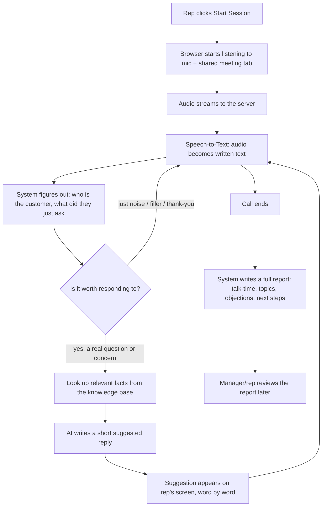

# How the AI Sales Assistant Works

---

## 1. What is this, in one sentence?

It's a tool that **listens to a live sales call and whispers helpful suggestions to the sales rep** — what to say next, the right price, the right answer to an objection — while the call is still happening. After the call ends, it also writes a **report card** about how the call went.

Think of it like a very well-informed colleague sitting next to the rep, listening to everything, and passing sticky notes with the right thing to say.

**Important:** this tool does not talk to the customer itself. It never generates a voice. It only helps the *human* rep talk better. The customer never knows it exists.

---

## 2. Who is it for?

A real-estate (or any) sales team that spends all day on calls answering the same kinds of questions — "What's the price?", "Where is it located?", "What amenities do you have?" — and wants:

1. Reps to never fumble a fact or forget a price.
2. Managers to get an automatic report on every call instead of listening to recordings for hours.

---

## 3. The big picture — how one call flows

Here is the entire journey of a single phone/meeting call, step by step, in the order it actually happens.

Let's walk through each box.

---

### Step 1 — Starting a call

The rep opens the dashboard and clicks **"Start Session."** The browser asks for permission to use the microphone (and, if the rep is on a Zoom/Meet call, permission to share that browser tab's audio too).

**Why two audio sources?** Because the system needs to tell the rep's voice apart from the customer's voice — reliably, not by guessing. The rep's own microphone is always "Channel 0" (that's the rep). The shared meeting tab's audio is always "Channel 1" (that's the customer). This is like recording two people on two separate microphones instead of one microphone in the middle of the room — much clearer, and there's no ambiguity about who said what.

If there's no meeting tab shared (say, the rep is on a phone call on speaker), the system simply treats whoever is speaking into the mic as the customer — useful for solo testing or phone-on-speaker calls.

---

### Step 2 — Turning speech into text

The audio is streamed, live, to a speech-recognition service (this uses a company called **Deepgram**, the same category of technology behind Siri or Google's voice typing). It converts spoken words into written text, in real time, as people are still talking. It also understands Hindi, English, and mixed Hindi-English sentences.

---

### Step 3 — Understanding what was just said

Every time the customer finishes a sentence, the system:
- Cleans it up (removes "umm," "so," filler words)
- Figures out if it's a **real, meaningful question** or just noise ("hmm," "okay," a one-word reply)
- If it's a follow-up like *"what about the 3BHK?"* — it remembers the previous topic so it understands what "it" or "that" refers to

If the sentence is too short or clearly just filler (like "okay," "yeah"), the system does nothing — it waits for something worth responding to. This saves time and avoids annoying pop-ups for every "uh-huh."

**One more thing it catches:** if the customer is just being polite — "thank you," "great, appreciate it" — the system recognizes this is a wrap-up, not a new question, and stays quiet instead of interrupting with another sales pitch.

---

### Step 4 — Finding the right facts

Now that the system knows *what* the customer is asking, it searches a knowledge base — think of it as a well-organized digital filing cabinet containing everything about the project: prices, floor plans, locations, amenities, loan options, etc.

It doesn't search by matching exact words — it searches by **meaning**. So "How much does a two-bedroom cost?" and "Price of 2BHK?" and "2BHK ka price kya hai?" (Hindi) all find the *same* correct pricing information, even though the words are completely different. This works because the system converts sentences into a kind of "meaning fingerprint" (a list of numbers) and compares fingerprints, not words.

It pulls out the 4-5 most relevant facts and hands them to the AI as reference material — like handing a colleague sticky notes with the exact numbers before they answer, so they don't have to guess or make things up.

---

### Step 5 — Writing the suggested reply

The system sends the customer's question, plus the relevant facts, plus a bit of context ("Have we already answered a similar question this call? What language are they speaking?") to an AI language model (Google's **Gemini**).

The AI does two things in one step:
1. **Decides what kind of moment this is** — Is the customer just saying hello? Asking a factual question? Raising an objection ("we're also talking to other builders")? Or wrapping up the call? It figures this out itself, by understanding the sentence — it's not a fixed checklist of trigger words, so it works no matter how the customer phrases things, in any language.
2. **Writes the actual suggested reply** in the right tone for that moment — a short, factual answer for a question; empathy plus a next step for an objection; a warm opening line for a greeting.

The reply is deliberately kept **short** — one or two sentences the rep can actually say out loud in real time, followed by one natural next question, instead of a long paragraph nobody has time to read mid-call.

If the customer asks the *same* thing again, the system notices and gently nudges the rep to move the conversation forward instead of repeating itself.

---

### Step 6 — Showing it to the rep

The suggested reply appears on the rep's screen and **types itself out live**, word by word, like someone typing in a chat — so the rep can start reading and speaking before the full sentence has even finished generating. This shaves crucial seconds off the wait.

If the customer suddenly changes topic before the AI finishes responding to the previous question, the system throws away the stale, half-finished suggestion and immediately starts on the new one — it never shows the rep an answer to a question that's no longer relevant.

---

### Step 7 — The call ends

When the rep clicks "End Session," everything that was said during the call — every sentence, every suggestion shown — has already been quietly saved in the background as the call was happening (not all at once at the end, so nothing is lost even if something goes wrong mid-call).

---

### Step 8 — The automatic report card

Once the call is over, the system builds a report automatically, without anyone lifting a finger. This report has two very different kinds of information in it, and it's worth understanding the difference:

**A. Things that are *measured*, not guessed** — these are just arithmetic on the actual transcript:
- How long the call lasted
- What percentage of the time the rep talked vs. the customer talked
- How many questions the customer asked
- The rep's speaking pace and how many filler words they used
- Exactly which moments had pushback/objections (with the customer's actual words quoted)

**B. Things the AI *assesses*, always backed by a quote** — these are judgment calls, like a human sales coach would make:
- How interested does this customer seem, overall?
- How likely is this deal to close?
- What was the mood like at the start, middle, and end of the call?

For every one of these judgment calls, the AI must point to the **exact sentence** the customer said that led it to that conclusion. It's not allowed to just make up a number — every score comes with receipts. This is deliberate: a manager should be able to click on "72% interested" and see the actual quote that justifies it, not just trust a mystery number.

The report also lists:
- Buying signals (things the customer said that show real interest)
- Objections raised
- Suggested next steps (who should do what — send a brochure, schedule a visit, follow up in 2 days)
- Coaching tips for the rep (e.g. "you did 70% of the talking — try asking more open questions")

---

## 4. What about while the rep is on the call — is there a live scoreboard?

Yes — the dashboard shows a few live stats that update as the call happens:
- Who's talking more, right now (talk balance)
- How many questions the customer has asked
- How many helpful suggestions have been shown so far

These are all things that can be **directly counted** from the conversation happening in front of you — nothing invented, nothing guessed.

---

## 5. The main ingredients (in plain terms)

| Ingredient | What it actually is | Why it's needed |
|---|---|---|
| **Deepgram** | A speech-to-text service | Converts spoken words into written text, live, in Hindi/English |
| **Gemini (Google's AI)** | A language model, similar to ChatGPT | Reads the question + facts, decides the tone, writes the suggested reply |
| **Knowledge base (Qdrant)** | A searchable library of facts about your projects/products | Makes sure answers are accurate, not made up |
| **Database** | Where every call, transcript, and report is permanently saved | So calls can be reviewed later and reports don't disappear |
| **The dashboard (website)** | What the rep and manager actually look at | Shows the live transcript, live suggestions, and past reports |

---

## 6. A note on honesty in the numbers

A deliberate design decision in this project: **every number shown to a user is either measured directly from the call, or is an AI judgment with a visible quote to back it up.** There are no invented "sentiment scores" pulled out of thin air, no fake-looking charts drawn just to look impressive. If a number can't be honestly measured or evidenced, it isn't shown. This matters because the whole point of the report is for a manager to *trust* it enough to make real decisions (like coaching a rep, or deciding a deal is worth chasing) — a report full of decorative-but-meaningless numbers would quietly destroy that trust the first time someone checked one.

---

## 7. What this tool is *not*

To avoid any confusion:
- It does **not** call customers itself, and it does **not** speak out loud to anyone. Everything it produces is text, shown only to the rep.
- It does **not** remember a customer from one call to the next (yet) — every call starts fresh, like meeting someone for the first time.
- It does **not** get smarter on its own over time — it doesn't "learn" from past calls the way a person would. Every call is handled the same way, using the same knowledge base.

---

## 8. Quick glossary

- **Transcript** — the written, word-for-word text of everything said on a call.
- **Knowledge base** — the digital library of facts (prices, locations, amenities) the AI is allowed to use when answering.
- **Suggestion** — the short reply the AI recommends the rep say next.
- **Intent** — what *kind* of moment a sentence is (a greeting, a real question, an objection, or a goodbye).
- **Post-call analysis / report** — the automatic summary generated after the call ends.
- **Live session** — the period while a call is actively being recorded and coached.

---

*This document is meant as a simple overview for anyone — technical or not — who wants to understand what the AI Sales Assistant does and how a call flows through it. It intentionally leaves out engineering detail; ask if you'd like the more technical version.*
