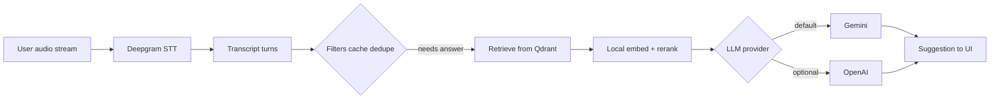

# AI Calling Assistant — Cost & Capacity Planning Guide

**Audience:** Product, finance, and leadership (non-engineering friendly)  
**Companion:** Engineering configuration in `app/core/config.py` (models, caches, timeouts)  
**Last updated:** April 2026  

---

## Important disclaimer

- Dollar figures in this document are **planning estimates** based on typical SaaS API pricing patterns and how **this codebase** uses third-party services.
- **Vendor prices change.** Before you commit budgets or customer pricing, confirm current rates on:
  - [Google AI — Gemini API pricing](https://ai.google.dev/pricing)
  - [OpenAI API pricing](https://openai.com/api/pricing/)
  - [Deepgram pricing](https://deepgram.com/pricing)
- **Embeddings and reranking** in this product run **on your own servers** (open-source models). You pay **compute (CPU/GPU/RAM)** and hosting—not per-token to Google/OpenAI for those steps.

---

## 1. Executive summary (one minute read)

| Question | Answer |
|----------|--------|
| What drives cost the most? | Usually **live streaming speech-to-text (Deepgram)** billed in **audio minutes**, especially if users stay connected for long calls. |
| What is second? | **Large language model (LLM)** usage: **Gemini** (default) or **OpenAI**, billed in **input + output tokens** per coaching suggestion. |
| What keeps LLM cost under control? | **Answer caching (Redis)**, **near-duplicate query skipping**, **minimum word thresholds**, and a **512-token output cap** reduce repeated or low-value LLM calls. |
| What do we need to plan monthly? | **Streamed hours** (or minutes) × STT rate **plus** **suggestion turns** × LLM token cost **plus** fixed **hosting** (servers, DB, Redis, Qdrant). |

---

## 2. What this product spends money on

| Layer | Service | How you are charged | Notes for this app |
|-------|---------|---------------------|-------------------|
| Speech | **Deepgram** | Typically **per minute** of audio streamed (model & language tier matter) | Default: **Nova-3**, multilingual (`multi`). |
| Answers | **Google Gemini** | **Per million input tokens** + **per million output tokens** | Default model id: **`gemini-2.5-flash`**. |
| Answers (alt.) | **OpenAI** | **Per million input tokens** + **per million output tokens** | Set `LLM_PROVIDER=openai`. Default model: **`gpt-4o-mini`**. |
| Search quality | **Qdrant + Redis** | **Infrastructure** (self-hosted or managed) | Not a “token” API cost; included in cloud bill. |
| Retrieval vectors | **Sentence Transformers** | **Your server** | No per-query API fee; needs RAM/CPU. |

---

## 3. Definitions the management team can use

| Term | Plain English |
|------|----------------|
| **Streamed minute** | One minute of live audio sent to Deepgram while a call/session is active (even if the user is quiet—unless you change product behavior to pause the stream). |
| **Suggestion turn** | One moment where the pipeline produces a new coaching answer after a **final** transcript segment passes business rules (e.g. long enough, lead speaker known). |
| **Token** | A small chunk of text the LLM reads (input) or writes (output). Rough guide: **~4 characters ≈ 1 token** for English; other languages vary. |
| **Cache hit** | The same (or very similar) question was answered recently; the system can **reuse** the prior answer and **skip** the LLM call. |

---

## 4. Reference LLM pricing (planning table)

**Action required:** Replace the example rates below with the **current** numbers from the official pricing pages before board-level sign-off.

The application caps coaching outputs at **512 output tokens** (`GEMINI_MAX_OUTPUT_TOKENS` / `OPENAI_MAX_OUTPUT_TOKENS` in config), which keeps answers short for live calls.

### 4.1 Google Gemini (default provider)

| Model (in app) | Role | Example input $/1M tokens | Example output $/1M tokens | When to use |
|----------------|------|---------------------------|----------------------------|-------------|
| **gemini-2.5-flash** | Default fast coach | *Confirm on Google pricing* — often **low–moderate** input, **higher** output vs some “mini” models | Same | **Default balance** of speed, multilingual quality, and cost. |

*Illustrative math only (not a quote):* if official pricing were approximately **$0.30 / 1M input** and **$2.50 / 1M output**, then **1 million output tokens** costs roughly the same as **~8×** one million input tokens. Short outputs (this app) **favor** scenarios where **input tokens** (prompt + knowledge snippets) dominate the bill.

### 4.2 OpenAI (optional provider — `LLM_PROVIDER=openai`)

| Model | Role | Example input $/1M | Example output $/1M | Management note |
|-------|------|--------------------|----------------------|-------------------|
| **gpt-4o-mini** | Default in config | *Confirm on OpenAI* — historically among the **cheapest** strong models for short answers | *Confirm on OpenAI* | Best **first alternative** for cost sensitivity; quality still strong for scripted sales coaching. |
| **gpt-4o** (or current “4o-class” flagship on pricing page) | Higher-quality phrasing | **Higher** than mini | **Higher** than mini | Use for **premium tier** or demos; **unit economics** must be recalculated. |
| **Newer “nano / mini” catalog** (e.g. GPT-5.x family on OpenAI’s page) | High volume, simple tasks | Varies by model | Varies by model | Evaluate **latency** and **Indian languages / code-switching** in QA before swapping defaults. |

**How to switch provider (engineering):** set environment **`LLM_PROVIDER=openai`**, provide **`OPENAI_API_KEY`**, and optionally adjust **`OPENAI_MODEL`**.

---

## 5. Deepgram (speech) — how to budget

Deepgram is usually priced **per audio minute** (prepaid credits or pay-as-you-go). Multilingual / Nova-class models may sit in a **higher** per-minute band than English-only legacy tiers.

**Planning formula:**

\[
\text{Monthly STT cost} \approx \text{Streamed minutes per month} \times \text{\$/minute from Deepgram}
\]

**Example (illustration only):**

- Assume **$0.008 / minute** after discounts (placeholder — **verify**).
- **10,000 streamed minutes / month** → \( 10{,}000 \times 0.008 = \$80 \) **STT only**.

**Why this matters for SaaS:** ten users each streaming **5 hours / month** is **3,000 minutes** already. Audio is often the **largest** variable cost if pricing does not include fair-use limits.

---

## 6. LLM token planning — simple scenarios

These scenarios assume **one LLM call per suggestion turn** (the dominant path). They **ignore** cache hits (which **lower** cost) and **ignore** occasional **translation** calls for some non-Latin queries (usually **small** vs main answer calls).

**Assumptions used below (tune with engineering):**

- **Input tokens per turn:** 2,500 (low), 4,000 (typical), 6,000 (heavy context)
- **Output tokens per turn:** 250 average (short spoken lines; cap allows up to 512)

### 6.1 Cost per 1,000 suggestion turns (LLM only)

Multiply:  
`turns × (input_tokens × input_rate + output_tokens × output_rate)`.

| Scenario | Input / turn | Output / turn | Example with **Gemini-style** rates ($0.30 in, $2.50 out / 1M) | Example with **GPT-4o-mini-style** rates ($0.15 in, $0.60 out / 1M) |
|----------|----------------|---------------|----------------------------------------------------------------|---------------------------------------------------------------------|
| Low | 2,500 | 250 | ~**$1.38** / 1k turns | ~**$0.53** / 1k turns |
| Typical | 4,000 | 250 | ~**$1.83** / 1k turns | ~**$0.75** / 1k turns |
| Heavy | 6,000 | 250 | ~**$2.43** / 1k turns | ~**$1.05** / 1k turns |

**How to read this:** at similar quality for short answers, **gpt-4o-mini-class** pricing is often **cheaper per turn** than **Gemini 2.5 Flash-class** pricing **when** output token prices are high—**but** total product cost still includes **Deepgram**, caching, and infra. Always recompute with **official** numbers.

---

## 7. Combined monthly example (for planning workshops)

**Scenario:** 50 active users × **8 hours** streamed audio each × **~35 LLM-eligible turns per hour** (after filters).

| Line item | Calculation (illustrative) | Example result |
|-----------|----------------------------|----------------|
| Streamed minutes | \( 50 \times 8 \times 60 = 24{,}000 \) minutes | 24k min |
| STT (placeholder **$0.008/min**) | \( 24{,}000 \times 0.008 \) | **~$192** |
| LLM turns | \( 50 \times 8 \times 35 = 14{,}000 \) turns | 14k turns |
| LLM (Typical row, Gemini-style rates) | \( 14 \times \$1.83 \) from §6.1 | **~$26** |
| LLM (Typical row, GPT-4o-mini-style rates) | \( 14 \times \$0.75 \) | **~$11** |
| Hosting (API + DB + Redis + Qdrant) | Flat estimate | **$50–300+** depending on provider |

**Takeaway:** in this illustration, **speech minutes dominate**. Improving **cache hit rate** or reducing **unnecessary streaming** moves gross margin more than switching LLM from one cheap model to another—**unless** LLM turns are very high.

---

## 8. Levers the team can use in the business plan

| Lever | Business effect | Owner |
|-------|-----------------|-------|
| **Fair-use streamed minutes** per subscription tier | Caps worst-case STT cost | Product / Finance |
| **Idle disconnect** (product behavior) | Fewer billed minutes when user is not on a call | Product / Engineering |
| **Answer caching TTL** (`ANSWER_CACHE_TTL_SECONDS`) | More reuse of identical FAQ-style questions | Engineering |
| **LLM provider & model** (`LLM_PROVIDER`, `OPENAI_MODEL`, `GEMINI_MODEL`) | Moves unit LLM cost; validate quality in Hindi/English mixed calls | Product + Engineering |
| **English-only STT** (`DEEPGRAM_LANGUAGE=en`, appropriate model) | May reduce Deepgram rate if multilingual not needed | Product |
| **Managed vs self-hosted** Qdrant/Redis | Predictability vs ops burden | Engineering / Finance |

---

## 9. Fixed and semi-fixed costs (launch checklist)

Use this as a **starter checklist** for “what do we pay even if usage is zero?”

| Item | Purpose | Rough order of magnitude |
|------|---------|---------------------------|
| Application hosting | FastAPI backend, WebSockets | $25–150+ / mo |
| Frontend hosting | Static or Node build | $0–50 / mo |
| Redis | Session + answer cache | Included or $10–50 / mo |
| Qdrant | Vector database | $0 (self-host) to $50+ managed |
| Observability / logs | Support & debugging | $0–100 / mo |
| Domain, email, secrets | Go-to-market basics | Small annual + monthly |
| Compliance (if needed) | DPA, privacy review | Project-based |

---

## 10. Suggested packaging for SaaS (finance-friendly)

| Plan element | Why it maps to COGS |
|--------------|---------------------|
| **Included streaming minutes / month** | Aligns directly with **Deepgram** |
| **Included “AI suggestion credits”** (optional) | Aligns with **LLM turns** if power users trigger more finals |
| **Overage price per minute** | Protects margin when usage spikes |
| **Enterprise: annual commit + volume** | Matches how STT vendors discount at scale |

---

## 11. Blank worksheet (copy into Excel / Sheets)

| Input | Your value |
|-------|------------|
| Expected **streamed minutes** / month | |
| Deepgram **$/minute** (from contract or pricing page) | |
| Expected **LLM suggestion turns** / month | |
| Avg **input tokens** / turn (engineering estimate) | |
| Avg **output tokens** / turn (engineering estimate) | |
| **Gemini** input $/1M & output $/1M | |
| **OpenAI** input $/1M & output $/1M (for chosen model) | |
| **Hosting + data** fixed cost / month | |

**LLM variable cost (month):**

\[
\text{LLM cost} \approx \frac{\text{turns} \times (\text{in} \times R_{\text{in}} + \text{out} \times R_{\text{out}})}{1{,}000{,}000}
\]

where \( R_{\text{in}} \) and \( R_{\text{out}} \) are your confirmed **$/token-million** rates.

---

## 12. Who to ask internally before publishing customer pricing

1. **Engineering:** typical **turns per streamed hour** on a pilot tenant (from logs).  
2. **Engineering:** **cache hit rate** on real transcripts.  
3. **Finance:** confirmed **vendor quotes** (Deepgram commit, Google Cloud / AI Studio billing, OpenAI org tier).  
4. **Product:** acceptable **latency** vs cheaper models (especially multilingual).

---

## Document history

| Version | Date | Changes |
|---------|------|---------|
| 1.0 | April 2026 | Initial management cost & capacity guide |
